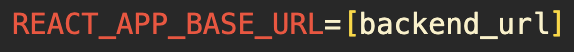
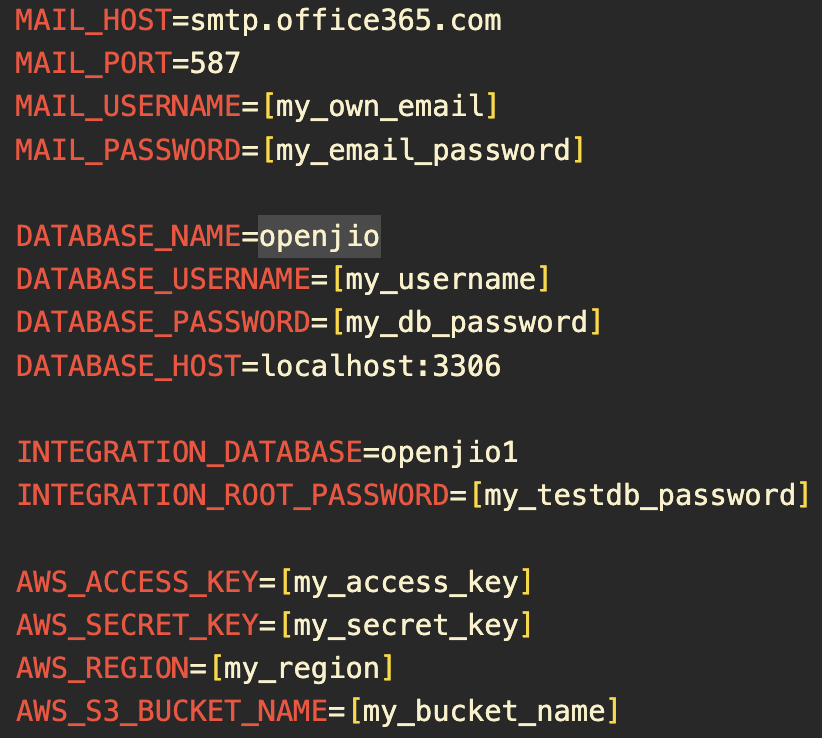

# OpenJio - CS203 Collaborative Software Development Project

This repository contains the source code for the OpenJio web application. OpenJio is a powerful and user-friendly events website tailored for university students, designed to enhance the way you discover, create, and participate in events on your campus.

## Features

- **Central Hub to Navigate and Discover New Events:** A vibrant digital marketplace where users can effortlessly explore a diverse array of events.


- **Student Score System:** Each student has their own score which is calculated behind the scenes based off their event attendance rates.


- **Customised Queue System with 4 Unique Algorithms:** Simplify the event registration process with our intuitive user interface. Most importantly, we incorporated a queue system depending on the type of event and have implemented 4 different queuing algorithms.


- **Event Creation for University Clubs and Societies:** Organisers can easily set up event details. They can also specify registration requirements, capacity limits, their queuing algorithm of choice and a filter to accept students based off their student score.


- **Generated Student Schedule for Signed Up Events:** An event schedule table is generated to indicate students' rejected, pending and accepted events.


- **JWT Authentication and Password Reset:** Upon login, our application provides you with a JWT token which is used to secure our API endpoints. We also have an email service to send you a token to reset your password. All these are implemented just to provide our users with a safe and secure application, so you can enhance your campus experience with ease!

# Technologies Used

## Tech Stack

**Frontend:** React (JavaScript + TypeScript) and styled with Tailwind CSS, shadcn & MUI libraries

**Backend:** Spring Boot

**Database:** MySQL

<p align="left"> <a href="https://www.w3schools.com/css/" target="_blank" rel="noreferrer">  </a> <a href="https://www.w3.org/html/" target="_blank" rel="noreferrer">  </a> <a href="https://www.java.com" target="_blank" rel="noreferrer">  </a> <a href="https://developer.mozilla.org/en-US/docs/Web/JavaScript" target="_blank" rel="noreferrer">  </a> <a href="https://www.mysql.com/" target="_blank" rel="noreferrer">  </a> <a href="https://reactjs.org/" target="_blank" rel="noreferrer">  </a> <a href="https://spring.io/" target="_blank" rel="noreferrer">  </a> <a href="https://tailwindcss.com/" target="_blank" rel="noreferrer">  </a> <a href="https://www.typescriptlang.org/" target="_blank" rel="noreferrer">  </a> </p>

## Deployment and CI/CD

**Continuous Integration:**

- Maven
- Docker Compose
- SonarQube and SonarCloud

**Continuous Delivery:**

- Docker
- AWS services

<p align="left"> <a href="https://aws.amazon.com" target="_blank" rel="noreferrer">  </a> <a href="https://www.docker.com/" target="_blank" rel="noreferrer">  </a> <a href="https://postman.com" target="_blank" rel="noreferrer">  </a> </p>

# Relevant Diagrams

## Database Entity-Related Diagram


## Workflow Diagram

This diagram consists of our CI/CD workflow and AWS architecture.


# Running our Application

As our repository contains both our frontend and backend code, please ensure that you run both applications separately (ideally on different windows). The next two sections cover how to configure your environment files properly to ensure a smooth installation.

## Configuring Frontend Environment Variables

1. Make a copy of the `sample-frontend.env` file in the root of the project directory and rename it as `.env`.
2. Place this file under `/frontend`.
3. Edit the `REACT_APP_BASE_URL` variable to `localhost:8080` or whichever port you are running your backend application on.



## Configuring Backend Environment Variables 

1. Make a copy of the `sample-backend.env` file in the root of the project directory and rename it as `.env`.
2. Place this file under `/jio/src/main/resources`.
3. Fill in the needed variables which have `[]` as shown in the screenshot below.

- You will need to create an outlook account or use an existing outlook account
- AWS access key, secret key and S3 bucket name have to be created and filled in
- The database username and password can be configured based on your local mySQL database instance
- The integration test database password can be any password you wish to set



## Frontend Installation
To start, make a copy of the repository with the `git clone` command or download the repository by clicking, `Code -> Download Zip` on the Github Repository Page.
```bash
git clone https://github.com/CS203-OpenJio/OpenJio
```
After cloning the project, you will need to `cd` into the frontend directory. Open up your terminal and run the following command:
```bash
# change directory into frontend
cd frontend
```
Once you ensure you are in the correct directory (/frontend) and configured the environment variables, run the following commands to start our application:
```bash
# install our npm libraries
npm install
# run our frontend application on port 3006
npm start
```
Nice! You should be able to view our frontend application on http://localhost:3006

## Backend Installation
To start, ensure  it is recommended to open our repository on a second window so as to separate the frontend and backend application. Next, you will need to `cd` into the backend directory. Open up your terminal and run the following command:
```bash
# change directory into backend
cd jio
```
Once you ensure you are in the correct directory (/jio) and configured the environment variables, run the following command:
```bash
# run our backend application on port 8080
./mvnw spring-boot:run
```
Great! Our backend application is now running on localhost:8080. You should be able to navigate our application as intended!

## Additional things to note

Do take note that this project uses the following ports on your localhost:
- `:3006` 
- `:3306`
- `:3307` (our Integration Test database)
- `:8080` 

This means if you have other web/system apps running on them, you might need to stop the apps running on the respective ports.

For any installation-related questions, you may direct them to @Shinkeishi on GitHub.

# Documentation

For documentation on the API endpoints and usage, refer to our Swagger API documentation.

# Contributors

Done by Ashley, Ron, Pramit, Ignatius, Darius and Justin

- Frontend Team: Ron (Lead), Ashley, Pramit
- Backend Team: Darius (Lead), Justin, Ignatius
- DevOps: Ashley
- Project Manager: Pramit
- Scrum Master: Ron
