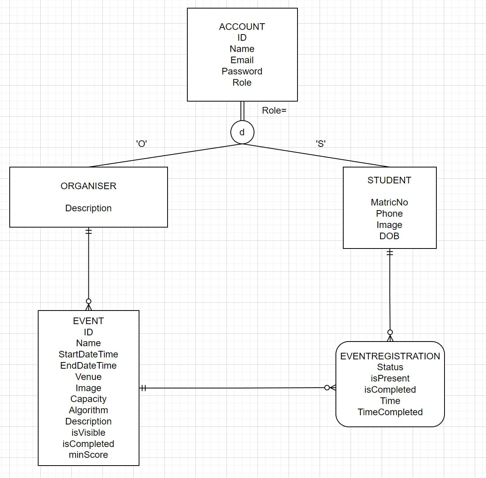
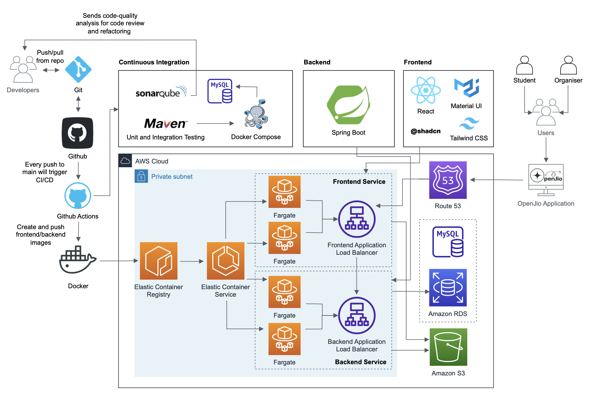

# OpenJio - CS203 Collaborative Software Development Project

This repository contains the source code for the OpenJio web application. OpenJio is a powerful and user-friendly events website tailored for university students, designed to enhance the way you discover, create, and participate in events on your campus.

## Features

1. **Central Hub to Navigate and Discover New Events**

A vibrant digital marketplace where users can effortlessly explore a diverse array of events.

2. **Student Score System**

Each student has their own score which is calculated behind the scenes based off their event attendance rates.

3. **Customised Queue System with 4 Unique Algorithms**

Simplify the event registration process with our intuitive user interface. Most importantly, we incorporated a queue system depending on the type of event and have implemented 4 different queuing algorithms.

4. **Event Creation for University Clubs and Societies**

Organisers can easily set up event details. They can also specify registration requirements, capacity limits, their queuing algorithm of choice and a filter to accept students based off their student score.

5. **Generated Student Schedule for Signed Up Events**

An event schedule table is generated to indicate students' rejected, pending and accepted events.

## Technologies Used

- **Frontend:** React (JavaScript + TypeScript) and styled with Tailwind CSS, shadcn & MUI libraries

- **Backend:** Spring Boot

- **Database:** MySQL

## Deployment Tools

**Continuous Integration:**

- Maven
- Docker Compose
- SonarQube and SonarCloud

**Continuous Delivery:**

- Docker
- AWS services

## Database Entity-Related Diagram

## Workflow Diagram

This diagram consists of our CI/CD workflow and AWS architecture.

## Documentation

For detailed documentation on the API endpoints and usage, refer to our Swagger API documentation linked below.

http://openjio-loadbalancer-backend-824860381.ap-southeast-1.elb.amazonaws.com/swagger-ui/index.html#/

## Contributors

Done by Ashley, Ron, Pramit, Ignatius, Darius and Justin
